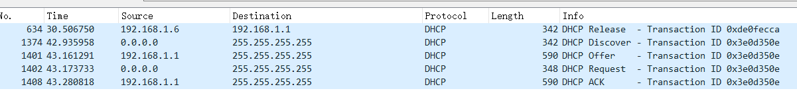
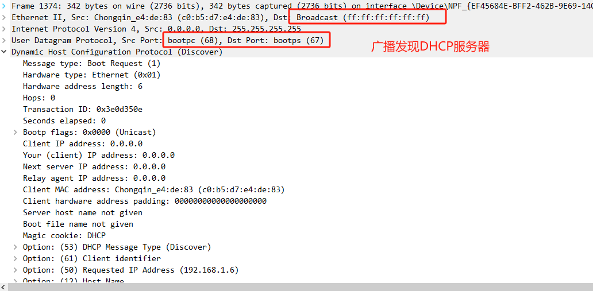
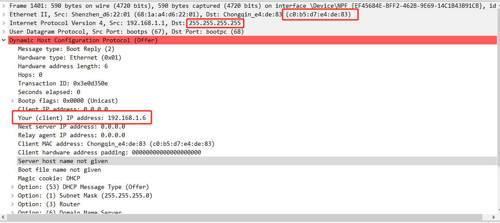
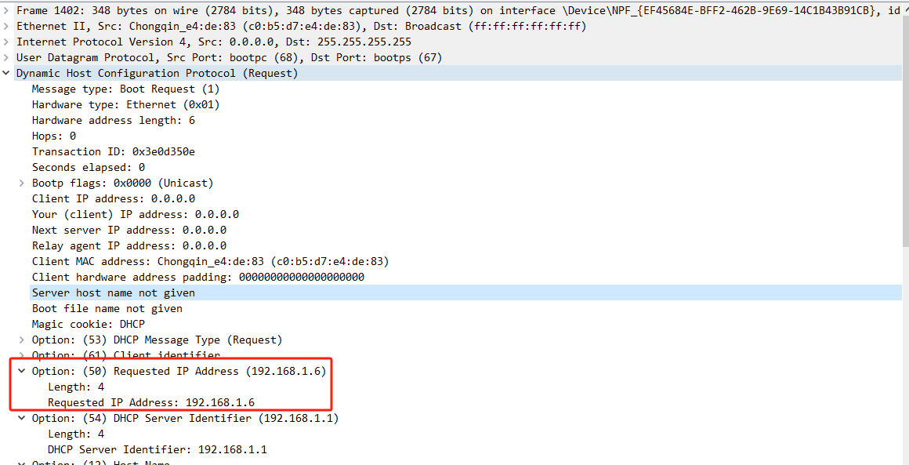
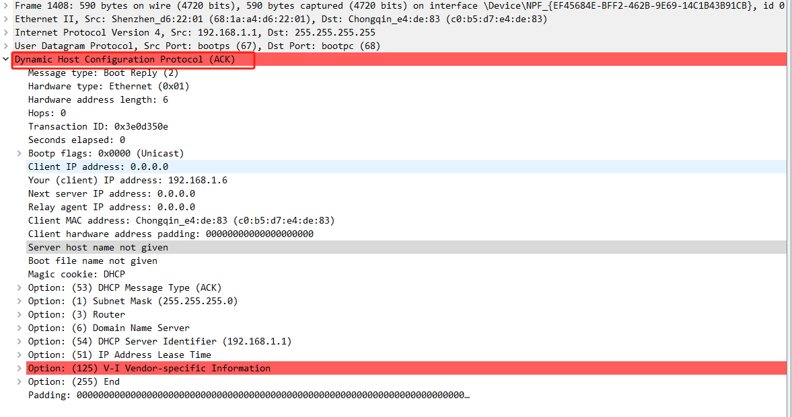
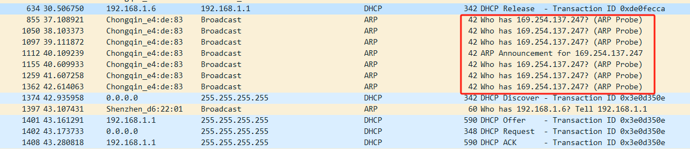

[toc]

# DHCP

### 简介

动态主机配置协议 (Dynamic Host Configuration Protocol，DHCP) 是一个**用于局域网**的网络协议，位于OSI模型的应用层，使用UDP协议工作，主要**用于自动分配IP地址给用户**，方便管理员进行统一管理。


DHCP服务器端使用67/udp，客户端使用68/udp。DHCP运行分为四个基本过程，分别为请求IP租约、提供IP租约、选择IP租约和确认IP租约。客户端在获得了一个IP地址以后，**就可以发送一个ARP请求来避免由于DHCP服务器地址池重叠而引发的IP冲突**。

**一句话概括：在局域网内，为新上线的设备分配IP地址，使其能够通信**

### 过程

过程如下图所示


一共四个阶段：发现阶段、提供阶段、选择阶段、确认阶段



#### 发现阶段

主机DHCP客户端向网络广播，寻找局域网DHCP服务器



#### 提供阶段

局域网DHCP服务器广播回应，并提供分配的IP地址等其他信息 其中OPTION3 提供了本网段的网关地址，也就是路由器地址。OPTION6提供了DNS地址



#### 选择阶段

主机可能会收到多个OFFER报文，但只会接受第一个，所以需要广播发送请求



#### 确认阶段

DHCP服务器 返回确认包，同意分配IP，否则返回NAK包



### 主机重连

当DHCP客户端重新连接到网络时，会发送REQUEST包，请求之前使用的IP地址


### 主机释放

主机可主动释放连接，放弃分配IP地址

```bash
ipconfig /release

ipconfig /renew
```


注意：客户端执行DHCP-DISCOVER后，如果没有DHCP服务器响应客户端的请求，客户端会随机使用169.254.0.0/16网段中的一个IP地址配置到本机地址。

169.254.0.0/16是Windows的自动专有IP寻址范围，也就是在无法通过DHCP获取IP地址时，由系统自动分配的IP地址段。


下图可以看到 主机在释放链接后，为自己分配169.254.137.247地址，并广播发送probe探测包，以及announcement包，捍卫自己的IP地址


