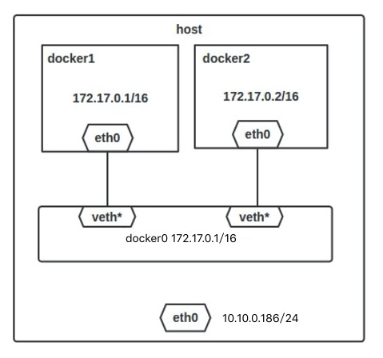
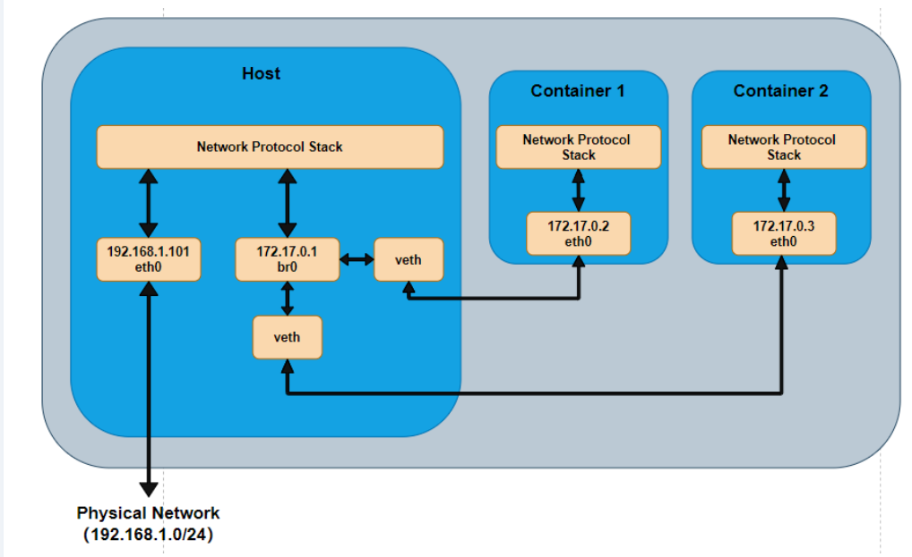

[toc]

# Docker网络模式

四种模式

- host 模式：使用 –net=host 指定。
- none 模式：使用 –net=none 指定。
- bridge 模式：使用 –net=bridge 指定，默认设置。
- container 模式：使用 –net=container:NAME_or_ID 指定。

## host

相当于 Vmware 中的桥接模式，与宿主机在同一个网络中，但没有独立 IP 地址。

容器将不会虚拟出自己的网卡，配置自己的 IP 等，而是使用宿主机的 IP 和端口。

但是，容器的其他方面，如文件系统、进程列表等还是和宿主机隔离的。

## container

这个模式指定新创建的容器和已经存在的一个容器共享一个 Network Namespace，而不是和宿主机共享。

新创建的容器不会创建自己的网卡，配置自己的 IP，而是和一个指定的容器共享 IP、端口范围等。

两个容器除了网络方面，其他的如文件系统、进程列表等还是隔离的。

## None

该模式将容器放置在它自己的网络栈中，但是并不进行任何配置。

该模式关闭了容器的网络功能

## Bridge

bridge 模式是 Docker 默认的网络设置，此模式会为每一个容器分配 Network Namespace、设置 IP 等，并将一个主机上的 Docker 容器连接到一个虚拟网桥上。下面着重介绍一下此模式。


当 Docker server 启动时，会在主机上创建一个名为 docker0 的虚拟网桥。所有使用bridge模式的容器都会连接到这个网桥上

单机环境下的网络拓扑如下，主机地址为 10.10.0.186/24

Docker 会使用 172.17.0.0/16 这个网段





### 容器如何和外部通信

主机上的iptable有规则，例如

```bash
-A POSTROUTING -s 172.17.0.0/16 ! -o docker0 -j MASQUERADE
```

这条规则会将源地址为 172.17.0.0/16 的包（也就是从 Docker 容器产生的包），并且不是从 docker0 网卡发出的，进行源地址转换，转换成主机网卡的地址。

也就是说，网络会在这一层改变