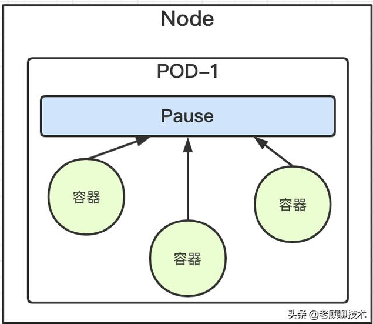
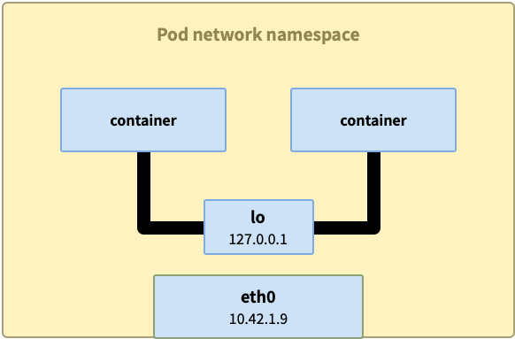
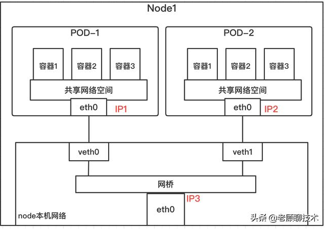
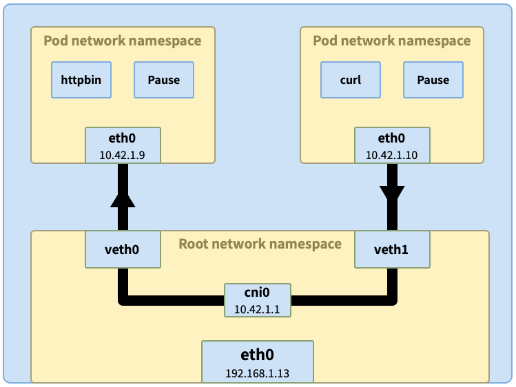
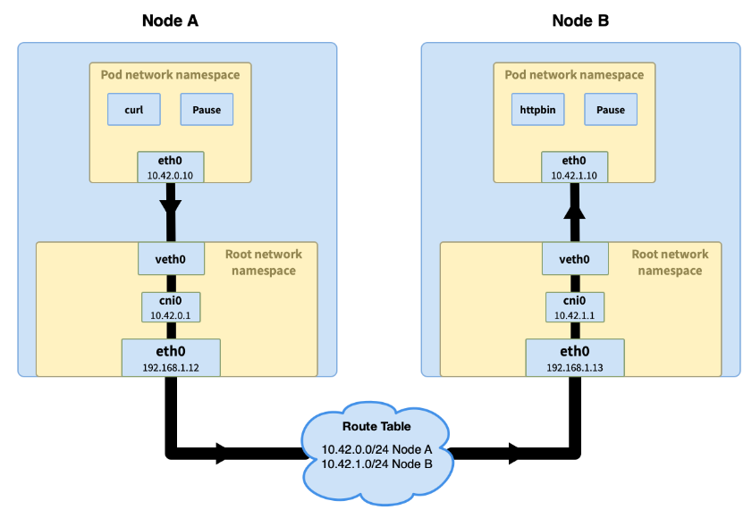

[toc]

# kubernetes网络模型

## 模型元素

- 每个 pod 都有自己的 IP 地址，这个 IP 在集群范围内可达
- Pod 中的所有容器共享 pod IP 地址（包括 MAC 地址），并且容器之前可以相互通信（使用 `localhost`）
- Pod 可以使用 pod IP 地址与集群中任一节点上的其他 pod 通信，无需 NAT
- Kubernetes 的组件之间可以相互通信，也可以与 pod 通信
- 网络隔离可以通过网络策略实现

上面的定义中提到了几个相关的组件：

- Pod：Kubernetes 中的 pod 有点类似虚拟机有唯一的 IP 地址，同一个节点上的 pod 共享网络和存储。
- Container：pod 是一组容器的集合，这些容器共享同一个网络命名空间。pod 内的容器就像虚拟机上的进程，进程之间可以使用 `localhost` 进行通信；容器有自己独立的文件系统、CPU、内存和进程空间。需要通过创建 Pod 来创建容器。
- Node：Node 是 Pod 真正运行的主机，可以是物理机，也可以是虚拟机，也称为宿主机。pod 运行在节点上，集群中包含一个或多个节点。每个 pod 的网络命名空间都会连接到节点的命名空间上，以打通网络。

## k8s通信

接下来看下 Kubernetes 中的网络通信如何完成，一共有几种类型：

- 同 pod 内容器间通信
- 同节点上的 pod 间通信
- 不同节点上的 pod 间通信

### 同Pod内容器通信

什么机制让同一个Pod内的多个docker容器相互通信?就是使用Docker的一种网络模型：–net=container

所有容器共享一个网络命名空间，共享pod的ip、端口等

同 pod 内的容器间通信最简单，这些容器共享网络命名空间，每个命名空间下都有 `lo` 回环接口，可以通过 `localhost` 来完成通信。

在k8s中每个Pod容器有一个pause容器有独立的网络命名空间

## 同节点上的 pod 间通信

上图为一个node，不同的pod通过虚拟接口组成的veth对连接不同的网络命名空间

`veth1` 通过网桥 `cni0` 与其他 pod 相连虚拟以太接口 `vethX` 相连，网桥会询问所有相连的接口是否拥有原始请求中的 IP 地址（比如这里的 `10.42.1.9`）。收到响应后，网桥会记录映射信息（`10.42.1.9` => `veth0`），同时将数据转发过去。最终数据经过 `veth0` 隧道进入 pod `httpbin` 中。

## 不同节点的pod间通信

前半部分的流程与同节点 pod 间通信类似，当请求到达网桥，网桥询问哪个 pod 拥有该 IP 但是没有得到回应。流程进入主机的路由寻址过程，到更高的集群层面。

在集群层面有一张路由表，里面存储着每个节点的 Pod IP 网段

